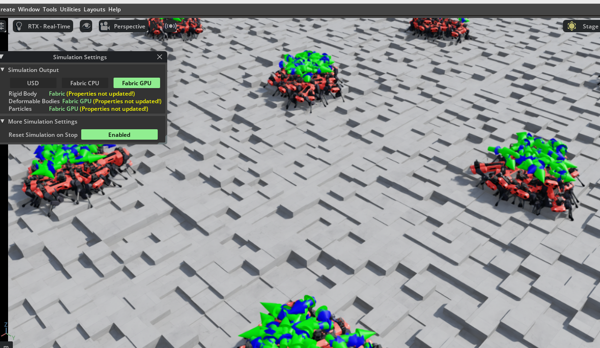
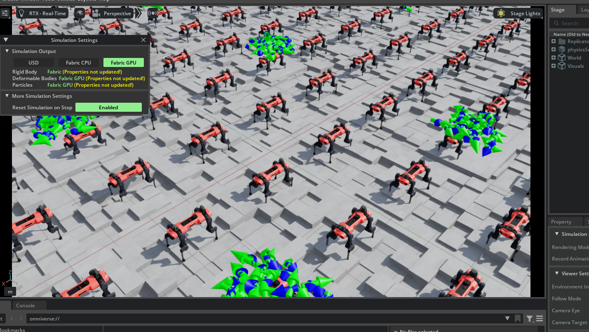
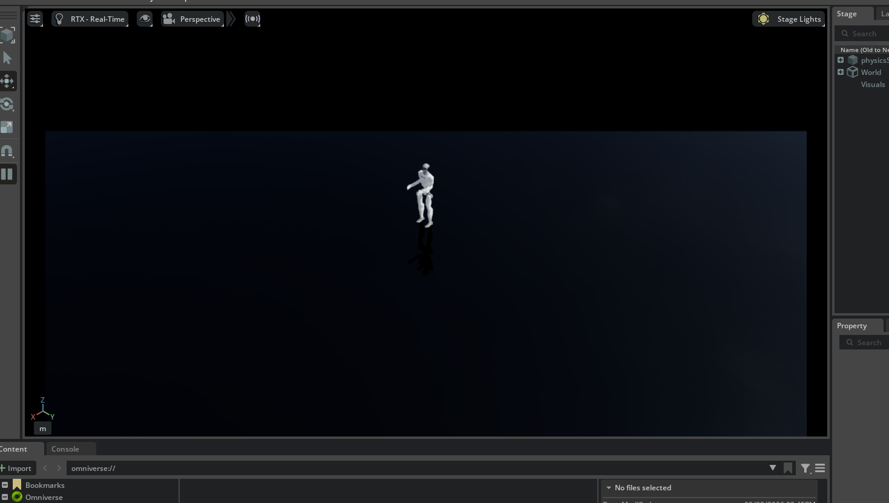
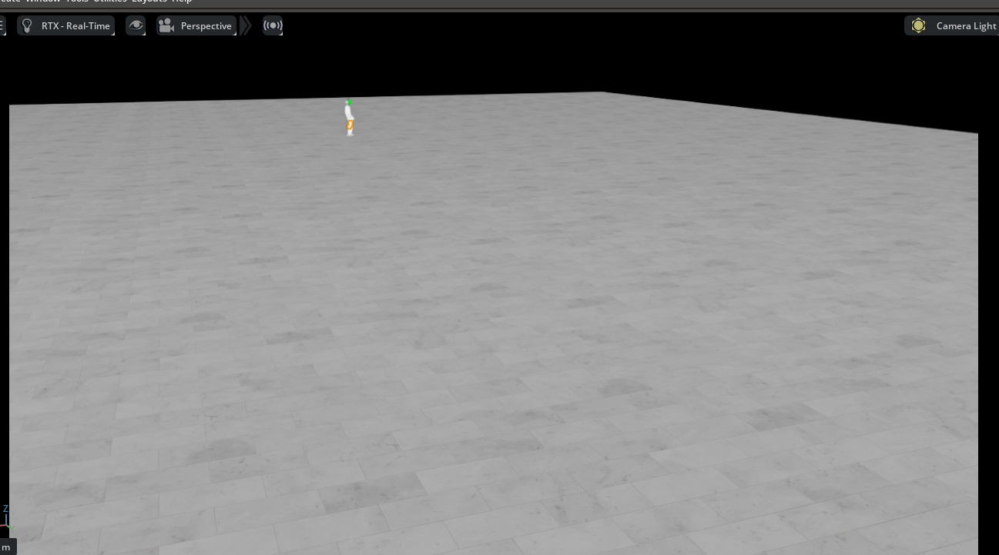
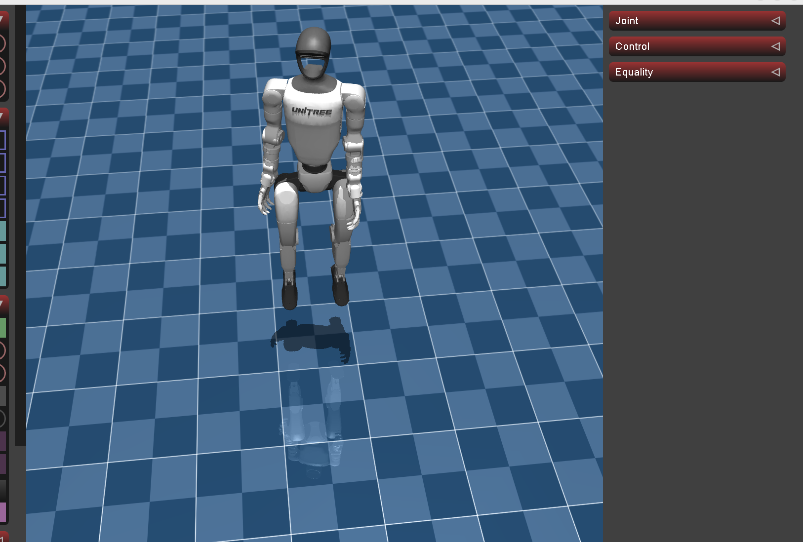

# Technical Implementation Record: Unitree G1 Reinforcement Learning Pipeline & MuJoCo Sim2Sim Integration

**Document Type:** Technical Implementation & Operational Verification Log  
**Target Platform:** Unitree Robotics Humanoid Robot "G1" (29-DoF Model)  
**Workstation / GPU:** NVIDIA GeForce RTX 5060 Ti (VRAM 16GB)  
**Core Stack:** Ubuntu 22.04 LTS, NVIDIA Driver 580.178.04, Isaac Sim 5.1.0, Isaac Lab v2.3.2, MuJoCo 3.x, Unitree SDK2  

---

## 1. Executive Summary & Objective

This technical log records the hands-on engineering procedures, parameter calibrations, and end-to-end verification of an advanced **Sim2Sim (Simulator-to-Simulator) pipeline** for the **Unitree G1 (29-DoF)** humanoid robot.

The objective is to establish an end-to-end simulation infrastructure that enables:
1. Highly parallelized Reinforcement Learning (RL) locomotion training inside NVIDIA Isaac Lab.
2. Direct policy checkpoint export (`.pt`).
3. Cross-simulator validation (Sim2Sim) inside the MuJoCo physics engine via a standalone C++ controller (`g1_ctrl`) and Unitree SDK2.

Testing conducted on the local engineering workstation (**NVIDIA GeForce RTX 5060 Ti 16GB**) confirmed that the complete pipeline—from Isaac Sim USD asset loading and parallel RL training to real-time interactive locomotion execution in MuJoCo—operates with high stability and reproducibility.

> **Note on Verification Data:**  
> All screenshots and plots embedded in this document are authentic live captures recorded directly by the engineer during real-time hands-on execution (system setup, training loop execution, debugging, and MuJoCo runtime validation) on the local GPU workstation.

---

## 2. Infrastructure & Hardware Specifications

| Component | Selected Specification / Version | Engineering Rationale |
| :--- | :--- | :--- |
| **GPU** | **NVIDIA GeForce RTX 5060 Ti (16GB VRAM)** | Ample VRAM enables large-scale parallel environments (`num_envs: 2048–4096`) without memory exhaustion |
| **Operating System** | **Ubuntu 22.04.5 LTS** (Kernel 6.8.0-138-generic) | Standard Linux robotics development distribution |
| **NVIDIA Driver** | **580 Series (580.178.04)** | Native support for latest GPU architecture and CUDA 12.8 compatibility |
| **Simulator Platform** | **NVIDIA Isaac Sim 5.1.0** (Standalone Binary) | High-fidelity Omniverse physics and rendering platform |
| **RL Framework** | **Isaac Lab v2.3.2** | Standardized reinforcement learning framework for robotics |
| **Python Environment** | **Python 3.11** (Miniconda: `env_isaaclab`) | Isaac Sim 5.x recommended runtime |
| **Deep Learning Stack**| **PyTorch 2.7.0 (CUDA 12.8 build)** | High-throughput tensor computing utilizing Tensor Cores |
| **Target Robot** | **Unitree G1 (29-DoF)** | Evaluated with full USD visual/collision assets |
| **Sim2Sim Environment**| **MuJoCo 3.x + Unitree SDK2 + g1_ctrl** | High-fidelity contact dynamics verification platform |

---

## 3. Implementation Workflow

```
[Phase 1: Isaac Sim Core Setup] 
   └── 5.1.0 standalone binary deployment, shader pre-compilation, environment variables
[Phase 2: Isaac Lab Integration] 
   └── Dedicated Conda environment, `_isaac_sim` symlink integration, RL dependencies
[Phase 3: Unitree G1 Model Integration] 
   └── Git LFS asset retrieval, USD articulation tree validation, absolute path configuration
[Phase 4: RL Training & Policy Evaluation] 
   └── Headless parallel locomotion training, checkpoint generation, policy visual replay
[Phase 5: MuJoCo Sim2Sim Deployment] 
   └── Unitree SDK2 build, C++ controller compilation, virtual gamepad interaction
```

---

## 4. Key Engineering Challenges & Solutions

### Challenge 1: GPU Driver & Kernel Compatibility
- **Issue:** Legacy setup guides recommended older NVIDIA drivers (525/535 series), which cause DKMS kernel module compilation failures on modern Linux 6.8 kernels and RTX 50-series hardware.
- **Solution:** Standardized on **NVIDIA Driver 580 (580.178.04)** with **PyTorch 2.7.0 (CUDA 12.8 build)**, unlocking full hardware acceleration.

### Challenge 2: PhysX Engine Overload Under Steep Terrains
- **Issue:** During initial high-concurrency training (`num_envs = 4096`) on rough block terrains, rapid inter-penetration spikes triggered PhysX buffer overflow (`PhysX has reported too many errors`).
- **Solution:** Adjusted solver parameters (`solver_position_iteration_count: 4 -> 8`) and tuned collision contact margins to stabilize rigid body dynamics.

### Challenge 3: Incomplete USD Binary Files via Git Clone
- **Issue:** Cloning the Hugging Face model repository without Git LFS resulted in pointer text files rather than actual 3D mesh binaries, causing simulator crashes.
- **Solution:** Installed and initialized `git-lfs` system-wide, verified mesh byte sizes, and standardized asset lookup paths to absolute filesystem locations.

### Challenge 4: Communication Domain ID Mismatch in Sim2Sim
- **Issue:** Virtual joystick commands failed to actuate the robot model inside MuJoCo.
- **Solution:** Rectified syntax typos in `config.yaml` (`use_joystick: 1`) and synchronized the DDS communication domain (`domain_id: 0`) with the C++ controller.

---

## 5. Live Runtime & Verification Records (Hands-on Screen Captures)

### 5.1 Isaac Lab Baseline Validation (ANYmal-C Quadruped Model)

Prior to G1 deployment, baseline multi-agent locomotion was verified using the `Isaac-Velocity-Rough-Anymal-C-v0` environment.

#### Multi-Agent Rough Terrain Initialization


#### PhysX Diagnostics & Articulation Inspection
When contact instabilities occurred, the Stage articulation hierarchy was inspected across individual limb links (`LF_HFE`, `LF_THIGH`, `LF_SHANK`, etc.) to isolate collision overlaps.




#### Velocity Goal Tracking & Stable Execution
Following solver tuning, command velocity vectors (`velocity_goal`) were visualized and confirmed to track stably across the terrain.


---

### 5.2 Unitree G1 Integration in Isaac Sim & Isaac Lab

The Unitree G1 29-DoF USD model was integrated into Omniverse, verifying kinematic chains, collision hulls, materials, and lighting.

#### G1 Joint Tree & Collision Hull Structure


#### G1 3D Visual Mesh Rendering


#### Ground Plane & SkyLight Configuration in Isaac Lab


#### Training Environment Hierarchy (`env_0`)


---

### 5.3 G1 Reinforcement Learning Metrics (TensorBoard)

Using `rsl_rl` for velocity-tracking training (`Unitree-G1-29dof-Velocity`), real-time training telemetry was logged and monitored via TensorBoard.

#### Curriculum Level Progression & Base Rewards


#### Detailed Reward Terms Convergence
Telemetry verified proper convergence across critical reward components: base height preservation (`base_height`), linear tracking velocity (`base_linear_velocity`), joint limit compliance (`dof_pos_limits`), foot clearance (`feet_clearance`), and foot slide minimization (`feet_slide`).


---

### 5.4 Cross-Simulator Sim2Sim Validation in MuJoCo

The trained neural network policy was exported and loaded into the standalone C++ controller `g1_ctrl` for real-time verification inside `unitree_mujoco`.



- **Verification Result:**
  - The G1 29-DoF humanoid model successfully maintains dynamic upright balance and responds smoothly to real-time directional commands dispatched via virtual joystick over DDS.
  - The end-to-end Sim2Sim pipeline—from large-scale parallel Isaac Lab policy synthesis to real-time MuJoCo physical execution—is fully verified and operational.

---

## 6. Summary & Next Steps

1. **Delivered Milestones:**
   - Operational runtime environment on RTX 5060 Ti 16GB with Isaac Sim 5.1.0 and Isaac Lab 2.3.2.
   - Successful training of Unitree G1 29-DoF locomotion policy with checkpoint persistence.
   - Real-time Sim2Sim policy execution within the MuJoCo physics engine via Unitree SDK2.
2. **Upcoming Objectives:**
   - Reward shaping for multi-terrain traversal (slopes, stairs, and obstacle stepping).
   - Domain randomization (surface friction, link payload variations, motor latency) for future Sim2Real physical hardware transfer.
